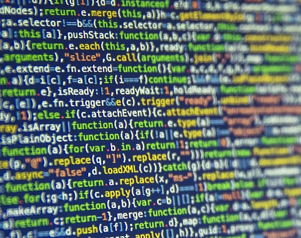
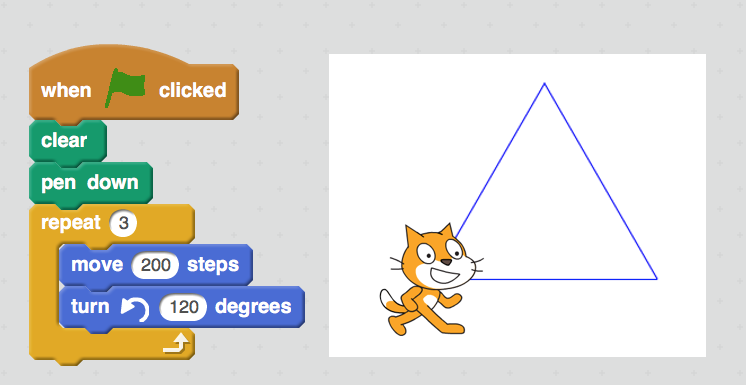

# CSO Holiday Workshop

## Coding, Computer Science & Computational Thinking

### Presented by: Daniel Hickmott
### Email: daniel.hickmott@uon.edu.au
### Website: newcastle.edu.au/cs4s

----

## About Me

- Studied Software Engineering 2010 - 2014

- Now in School of Education, studying PhD about Teacher Professional Learning (TPL)

- Interested in implementation of Digital Technologies curriculum

- Involved in TPL workshops in this area since 2013

- And you?

---

## Session Schedule

- Presentation: Coding, Computer Science & Computational Thinking (~20 minutes)

- Activity 1: Teaching Computer Science without a Computer (~40 minutes)

- Activity 2: Visual Programming with Scratch (~1 hour)

---

## Coding, Computer Science & Computational Thinking

---

## What is Coding?

- Coding, or computer programming[^1], is the act of writing instructions for a computer in a programming language

- Computers can only understand specific and precise instructions, generally can't deal with ambiguity

[^1]: https://k6.boardofstudies.nsw.edu.au/wps/portal/go/science-and-technology/statement-on-coding

---

## What is Coding?

- Code should be written for humans first and computers second

- Visual Programming Languages, such as Scratch, allow anyone to get started Coding without knowing particular keywords and syntax

- Encouraging students to learn how to code has become a global movement, e.g. the Hour of Code

--- 

## Why teach Coding in K - 12?

1. To prepare students for their future careers

2. To help students understand the "digital world"

3. To allow students to formally define processes as a way to gain understanding about concepts

4. To give students another way to create and express themselves

**1. is often emphasised but the other 3 are just as, if not more, important**

---

## What is Computer Science?

- Computer Science is a field which encompasses a variety of disciplines, e.g: Artificial Intelligence

- Despite the name - not just about computers! At its core, CS is about problem solving

- Writing Algorithms, step-by-step procedures that can be performed by a computer, are central to CS

- Some disciplines of CS are very close to Mathematics and may not involve any coding at all!

---

**What is Computer Science?**

*What would we like our children - the general public of the future - to learn about computer science in schools? We need to do away with the myth that computer science is about computers. __Computer science is no more about computers than astronomy is about telescopes,__ biology is about microscopes or chemistry is about beakers and test tubes. __Science is not about tools, it is about how we use them and what we find out when we do.__*[^2]

[^2]: Michael R. Fellows, Ian Parberry (1993) "SIGACT trying to get children excited about CS". in: Computing Research News. January 1993.

---

## Where do Computer Scientists work?

- At software companies, like Google and Microsoft

- At the University of Newcastle, supporting Education and Psychology researchers

- At the Hunter Medical Research Institute, working with Biologists and Medical researchers

- Lots of other different research areas and industries![^3]

[^3]: http://www.refractionmedia.com.au/careerswithcode/

---

## What is Computational Thinking?

- *"Thinking like a Computer Scientist"[^4]*

- A way of approaching solving problems: **not** thinking about or like a computer

- *"Most obviously apparent, and probably most effectively learned, through the rigorous, creative processes of writing code."[^5]*

[^4]: https://www.cs.cmu.edu/~15110-s13/Wing06-ct.pdf

[^5]: http://barefootcas.org.uk/barefoot-primary-computing-resources/concepts/computational-thinking/

---

## Core Computational Thinking Concepts[^6]

- **Logical Reasoning:** predicting and analysing

- **Algorithms:** making steps and rules

- **Decomposition:** breaking down into parts

- **Patterns:** spotting & using similarities

- **Abstraction**: removing unnecessary detail

- **Evaluation**: making judgement

[^6]: http://barefootcas.org.uk/barefoot-primary-computing-resources/concepts/computational-thinking/

---

## Computational Thinking in K - 12 

- US, UK, New Zealand and others have introduced compulsory curricula with focus on CT in both primary and high school

- In Australia, Digital Technologies endorsed as part of national curriculum

- In NSW, BOSTES recommends integrating Coding and CT across the syllabuses

---

## Summary

- *Computational Thinking* has been proposed as a problem solving process that can be beneficial for all students

- Computer Scientists are primarily problem solvers that work in a variety of industries and research areas

- After analysing a problem Computer Scientists usually attempt to solve the problem by Coding a solution to the problem
