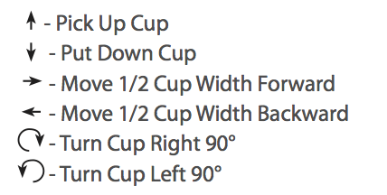
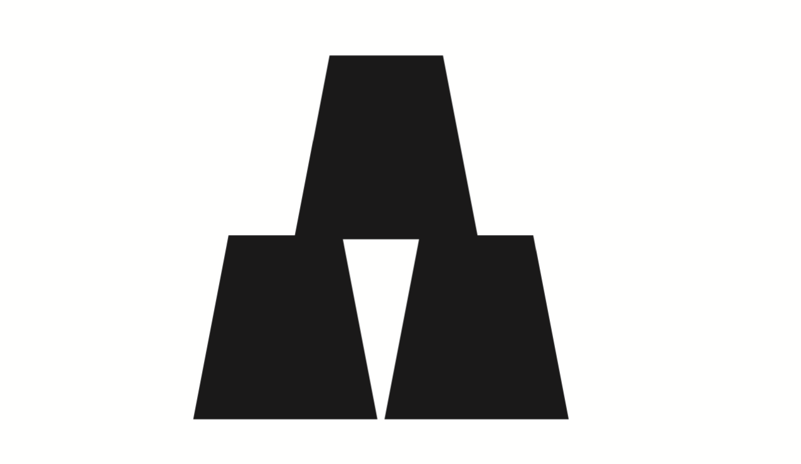
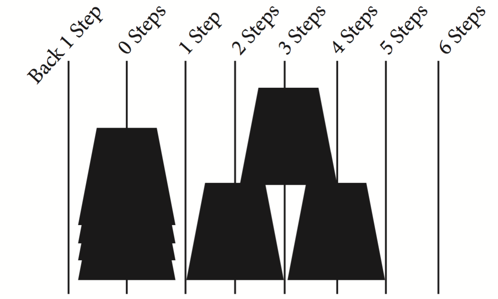
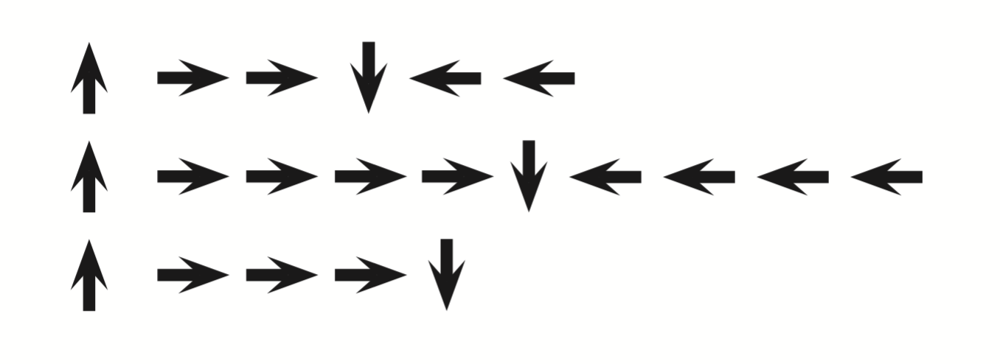
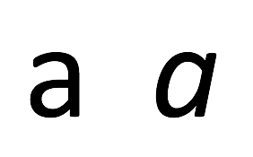
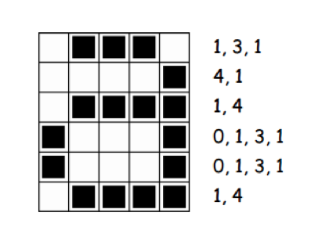
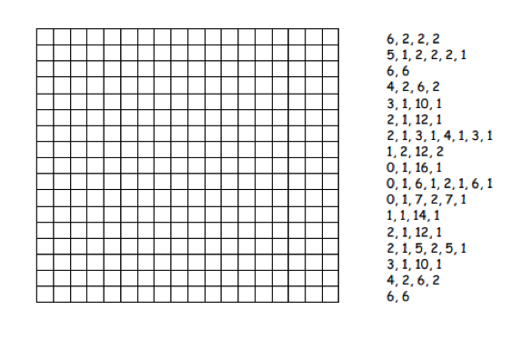
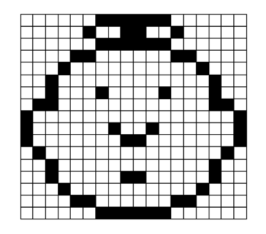

# Teaching Computer Science Without a Computer

---

# Session Plan

- Introduction to Unplugged methods (~5 minutes)
- Unplugged activities (~30 minutes): 
	- My Robotic Friends 
	- CSUnplugged: Binary Numbers & Image Representation

---

# Teaching CS without a Computer

- CS is not just about computers!
- What if you have no access to computer lab?
- What if students don't have the ICT skills to use certain apps / devices?
- Can use *unplugged* methods

---

# Activities

- We are going to split into groups of 4 - 5
- Then split into sub-groups (computer scientists and robots)
- The robots will work on CSUnplugged activities
- The computer scientists will work on My Robotic Friends
- Then we'll swap
- But not yet, I will explain *My Robotics Friends* first

---

# My Robotic Friends

- Created by *Thinkersmith* for CSEd week
- An example of sequencing and writing algorithms
- Choose a cup tower (or a few) for the robots to build
- The computer scientists will write instructions for robots

---

# My Robotic Friends

But you can only use the following six symbols:

---

# My Robotic Friends - Example

We may want our robot to build this tower:

---

# My Robotic Friends - Example

Start from the cup stack - each step is 1/2 a cup width

---

---

# My Robotic Friends

- Split into groups of 4 - 5
- Then split groups into computer scientists / robots
- Computer scientists will write algorithms for 10 - 15 minutes
- Robots will do the CSUnplugged activities
- Swap over and robots will follow the algorithms and write their own for 10 - 15 minutes
- Come back together for a wrap-up at the end

---

# Computer Science Unplugged

- CS Unplugged for short
- A collection of free activities
- Large range of concepts relevant to DT curriculum
- Activities targeted at age groups 5 - 12 - but for anyone!
- We will do the *Binary Numbers* & *Image Representation*  activities today

---

# CS Unplugged - Binary Numbers

- When a binary number card is not showing - it is represented by a 0
- When is it showing, it is represented by a 1
- This is the binary number system
- The system we normally use is the decimal system 
- decimal = 10 digits = 0 1 2 3 4 5 6 7 8 9
- binary = 2 digits = 0 1

---

# CS Unplugged - Binary Numbers

- What number is 10001 in decimal?
- What would 17 be in binary?
- How about 6, 15, 21?

---

# CS Unplugged - Binary Numbers

- What do you notice about the number of dots on the cards? 
- How many dots would the next card have if we carried on to the left?
- What is the biggest number you can make? What is the smallest? 

--- 

# CS Unplugged - Binary Numbers

- Is there more than one way to get any number? 

- Is there any number you can’t make between the smallest and biggest numbers? 

- Now try counting from zero onwards, is there a pattern?

---

# CS Unplugged - Binary Numbers

- What happens when you put a 0 on the right of a binary number?

- Is there a pattern for odd and even numbers? 

--- 

## CS Unplugged - Image Representation

- How could you represent differents fonts or images on a computer?

---

## CS Unplugged - Image Representation

---

## CS Unplugged - Image Representation

---

## CS Unplugged - Image Representation

